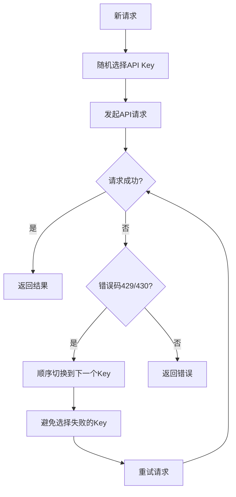

# 🎵 SunoMusicGen - VCP音乐生成插件 v2.2


## 📋 简介

SunoMusicGen 是一个为 VCPToolBox 开发的**异步音乐生成插件**，使用新的 Suno API (sunoapi.org) 来生成高质量的AI音乐。

## ✨ 功能特性

### 🎵 音乐生成
- **描述模式**: 通过简单的文字描述生成音乐
- **自定义模式**: 提供完整歌词、风格和标题进行精确控制
- **异步处理**: 支持长时间生成任务，不阻塞系统
- **🆕 多API Key轮换**: 支持配置多个API Key自动轮换使用

### 🎼 模型选择
| 模型 | 特点 | 最长时长 | 推荐场景 |
|------|------|----------|----------|
| **V3_5** | 创意多样性高 | 4分钟 | 实验性创作 |
| **V4** | 最佳音频质量 | 4分钟 | 标准音乐制作 |
| **V4_5** | 高级功能 | 8分钟 | 专业级制作 |

### 🔄 异步机制
- 使用占位符系统自动更新结果
- 支持WebSocket实时推送状态
- 任务结果持久化存储

### 🔑 多API Key支持（智能混合策略！）
- 支持配置多个API Key，用逗号分隔
- **混合轮换策略**：
  - 新请求时**随机选择**API Key，均衡负载
  - 遇到限制错误时**顺序切换**到下一个Key
  - 避免重复选择刚失败的Key
- 智能处理429（积分不足）和430（频率过高）错误
- 自动重试机制，最大化成功率

## 🚀 安装配置

### 1. 配置API密钥

1. 复制配置文件模板:
```bash
cp config.env.example config.env
```

2. 编辑 `config.env` 文件:
```env
# 必需配置
# 支持单个API Key
SUNO_API_KEY=your_api_key_here

# 或者配置多个API Key（用逗号分隔）
SUNO_API_KEY=key1,key2,key3

# 可选配置
SUNO_API_BASE_URL=https://api.sunoapi.org
POLLING_INTERVAL_MS=10000  # 轮询间隔(毫秒)
MAX_POLLING_ATTEMPTS=60     # 最大轮询次数
CALLBACK_URL=               # Webhook回调URL(可选)
```

2. 从 [sunoapi.org](https://sunoapi.org/api-key) 获取API密钥

### 📌 多API Key配置说明
- 多个Key用英文逗号分隔，如：`key1,key2,key3`
- 插件会自动识别并加载所有Key
- 遇到限制错误时自动切换到下一个Key
- 循环使用所有可用的Key

## 📝 使用方法

### 方式一：描述模式（简单）

适合快速生成音乐，只需描述想要的音乐风格：

```
<<<[TOOL_REQUEST]>>>
maid:「始」Nova「末」,
tool_name:「始」SunoMusicGen「末」,
command:「始」submit「末」,
prompt:「始」一首宁静的钢琴曲，带有雨声，适合深夜工作「末」,
instrumental:「始」true「末」,
model:「始」V4「末」
<<<[END_TOOL_REQUEST]>>>
```

### 方式二：自定义模式（高级）

完全控制歌词、风格和标题：

```
<<<[TOOL_REQUEST]>>>
maid:「始」Nova「末」,
tool_name:「始」SunoMusicGen「末」,
command:「始」submit「末」,
customMode:「始」true「末」,
prompt:「始」[Verse 1]
清晨的第一缕阳光
穿过窗帘洒在床上
新的一天充满希望
和你一起迎接晨光

[Chorus]
美好的时光让我们歌唱
幸福就在身旁
每一天都是新的开始
有你陪伴不再彷徨「末」,
style:「始」温暖民谣「末」,
title:「始」晨光之歌「末」,
model:「始」V4_5「末」
<<<[END_TOOL_REQUEST]>>>
```

### 延长现有音乐

支持两种延长模式：

**使用原始参数（简单）：**
```
<<<[TOOL_REQUEST]>>>
maid:「始」Nova「末」,
tool_name:「始」SunoMusicGen「末」,
command:「始」extend「末」,
defaultParamFlag:「始」false「末」,
audioId:「始」你的音频ID「末」,
model:「始」V4「末」
<<<[END_TOOL_REQUEST]>>>
```

**自定义延长参数（高级）：**
```
<<<[TOOL_REQUEST]>>>
maid:「始」Nova「末」,
tool_name:「始」SunoMusicGen「末」,
command:「始」extend「末」,
defaultParamFlag:「始」true「末」,
audioId:「始」你的音频ID「末」,
continueAt:「始」60「末」,
prompt:「始」添加一段优美的吉他独奏作为尾奏「末」,
style:「始」古典流行「末」,
title:「始」晨光之歌-延长版「末」,
model:「始」V4_5「末」,
vocalGender:「始」f「末」,
styleWeight:「始」0.8「末」
<<<[END_TOOL_REQUEST]>>>
```

### 查询任务状态

虽然通常不需要手动查询（占位符会自动更新），但在特殊情况下可以使用：

```
<<<[TOOL_REQUEST]>>>
maid:「始」Nova「末」,
tool_name:「始」SunoMusicGen「末」,
command:「始」query「末」,
taskId:「始」suno_task_abc123「末」
<<<[END_TOOL_REQUEST]>>>
```

## 🎯 占位符机制

当提交音乐生成任务后，系统会返回一个占位符：
```
[任务 SunoMusicGen (ID: suno_task_xyz) 结果待更新...]
```

这个占位符会在音乐生成完成后**自动替换**为实际结果，包含：
- 🎵 音乐标题和风格
- ⏱️ 音频时长
- 🔗 可直接播放的音频链接
- 🖼️ 封面图片
- 📁 本地存储路径

## 📂 文件存储

生成的音乐文件会自动保存到：
```
VCPToolBox/
└── file/
    └── music/
        ├── suno_task_abc123_1.mp3
        ├── suno_task_abc123_2.mp3
        └── ...
```

## ⚠️ 注意事项

1. **生成时间**: 
   - V3_5/V4: 通常需要30秒-2分钟
   - V4_5: 可能需要2-5分钟

2. **API限制**: 
   - 请注意你的API积分使用情况
   - 每次生成通常产生2个版本
   - 使用多个API Key可以有效规避限制

3. **文件管理**:
   - 音频文件会永久保存在本地
   - 定期清理不需要的文件以节省空间

## 🔧 故障排除

### 问题1：API密钥错误
- 确保 `config.env` 中正确设置了 `SUNO_API_KEY`
- 检查API密钥是否有效且有足够积分
- 如果有多个Key，确保用逗号正确分隔

### 问题2：生成超时
- 可以增加 `MAX_POLLING_ATTEMPTS` 的值
- 检查网络连接是否稳定

### 问题3：文件下载失败
- 确保 `file/music/` 目录有写入权限
- 检查磁盘空间是否充足

### 问题4：频率限制
- 配置多个API Key可以有效避免429/430错误
- 插件会自动切换到下一个可用的Key

## 📊 版本历史

### v2.2.0 (2025-09-16) - 智能混合轮换策略
- 🎯 实现混合API Key轮换策略（随机+顺序）
- 🔄 优化错误重试机制
- 📊 更好的负载均衡

### v2.1.0 (2025-09-16) - 多API Key支持
- ✨ 新增多API Key轮换功能
- 🔄 智能处理API限制错误
- 📝 完善extend功能文档

### v2.0.0 (2025-09-16) - 异步版本
- ✨ 完全重写为异步插件架构
- 🚀 支持占位符自动更新机制
- 📡 添加WebSocket状态推送
- 💾 自动下载和本地存储
- 🔄 后台轮询和回调机制

### v1.0.0 (2025-09-15) - 初始版本
- 基础音乐生成功能
- 支持三种模型
- 同步处理模式

## 🛠️ 技术架构


### API Key智能混合轮换机制


**混合策略优势**：
- 🎲 **随机选择**：新请求随机分配，避免热点
- ➡️ **顺序切换**：错误时有序切换，确保不重复失败
- 🔄 **智能重试**：自动使用下一个可用Key重试
- ⚖️ **负载均衡**：所有Key均匀使用